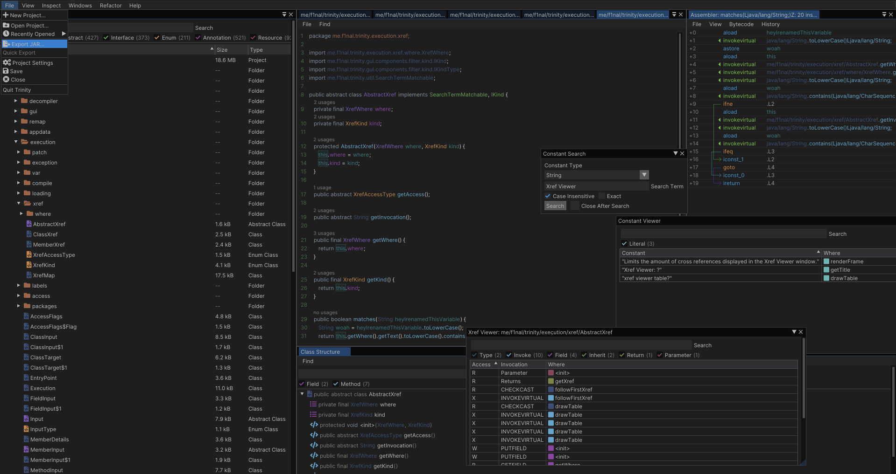

# Trinity 
Trinity is a powerful lightning-fast software reverse engineering suite for the Java bytecode architecture handling highly obfuscated binaries with ease.

## Features
- Databases
- Assembler
- Decompiler
- Renaming Code
- Cross-Referencing
- Constant Search
- Automatic Refactoring
- Deobfuscation

## Authors
- [@final](https://www.github.com/firstfault)

### Contributing
Contributions are massively appreciated. Please feel free to open an issue or pull request if anything you need is missing.

Please review the [planned features](PLANNED.md) before requesting a feature addition!

### Libraries Used
- [ImGui](https://github.com/ocornut/imgui) with [Bindings](https://github.com/SpaiR/imgui-java)
- [ObjectWeb ASM](https://asm.ow2.io/)
- Modified version of [Fernflower Decompiler](https://www.jetbrains.com/)

#### Who is this meant for?
Hackers, hobbyists, professionals, everyone is welcome.

#### Context
Originally Trinity started out as an obfuscator with an interactive interface. Over time, I began using it as a decompiler, and eventually it evolved into this awesome tool.