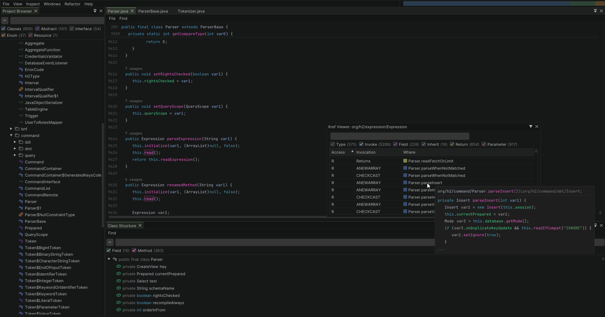
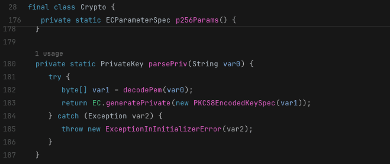
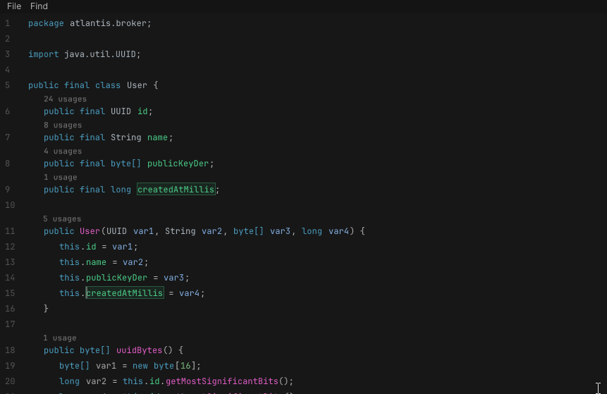
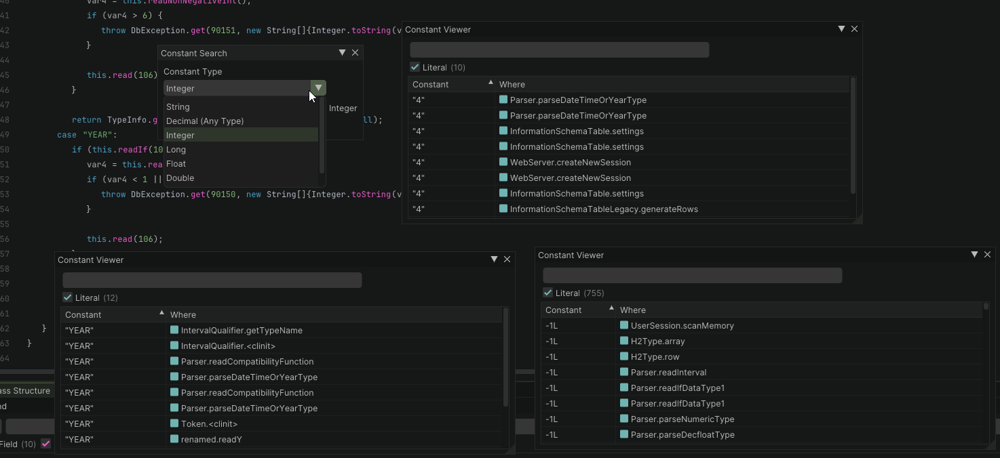

<div align="center">
  <a href="https://github.com/firstfault/trinity">
    
  </a>
  <h1>Trinity</h1>
  <p>A next-generation Java reverse-engineering workspace for exploring, understanding, and rewriting bytecode.</p>

  <p>
    <a href="https://github.com/firstfault/trinity/releases"></a>
    <a href="LICENSE"></a>
    
    
    <a href="https://github.com/firstfault/trinity/stargazers"></a>
  </p>

  <sub>Decompiler &middot; Assembler &middot; Extensive Cross-referencing &middot; Instant Refactoring</sub>
</div>




## What makes Trinity stand out?

### Decompiler

Trinity approaches decompilation differently. Built on the battle-tested [Fernflower](https://www.jetbrains.com/), it integrates directly with the decompiler engine instead of treating the generated Java as plain text. Numerous bugs and anti-decompilation exploits are fixed.

### Renaming

Rename variables, fields, methods, and classes in place. Trinity updates every known usage across the workspace immediately, so you can turn an unreadable codebase into something understandable as you investigate it.



### Cross-referencing

Trinity's cross-reference (Xref) search is instant and exceptionally thorough. It follows references throughout the bytecode, including class literals, annotations, casts, method parameters, return types, field accesses, and invocations.



### Constant search

Search constants across the entire project <b>instantly</b>, not just the strings visible in decompiled source. Strings, numbers, class literals, annotation values, bootstrap arguments, and other class-pool constants are all discoverable.



### Workspaces

Load one or several files into a workspace, edit their classes and members, and save the complete project as a compressed Trinity database (`.tdb`), letting you resume your work right where you left it off.

### ...and more!

Built-in refactoring / deobfuscation, custom themes, a built-in theme editor, configurable key mappings, among many others

## Building

Running Trinity requires Java 17 or newer. Gradle 8.4 builds require JDK 17-20; build and run with the checked-in wrapper:

```bash
git clone https://github.com/firstfault/Trinity.git
cd Trinity
./gradlew run
```

The executable fat JAR is produced at `build/libs/Trinity.jar` by `./gradlew build`.
Pre-built versions are available from [GitHub Releases](https://github.com/firstfault/Trinity/releases).

## Authors
- [@final](https://www.github.com/firstfault)

### Contributing
Contributions are massively appreciated. Please feel free to open an issue or pull request if anything you need is missing.

### Libraries Used
- [ImGui](https://github.com/ocornut/imgui) with [Bindings](https://github.com/SpaiR/imgui-java)
- [ObjectWeb ASM](https://asm.ow2.io/)
- Modified version of [Fernflower Decompiler](https://www.jetbrains.com/)
