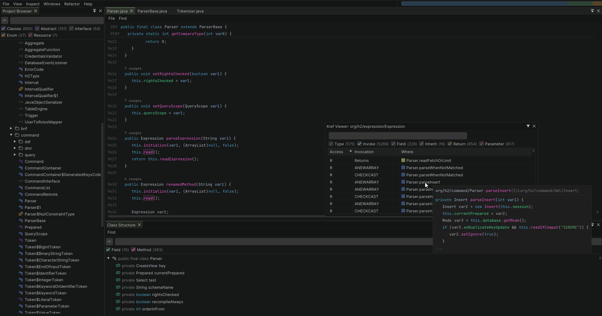
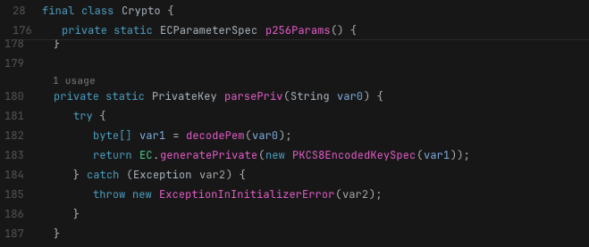
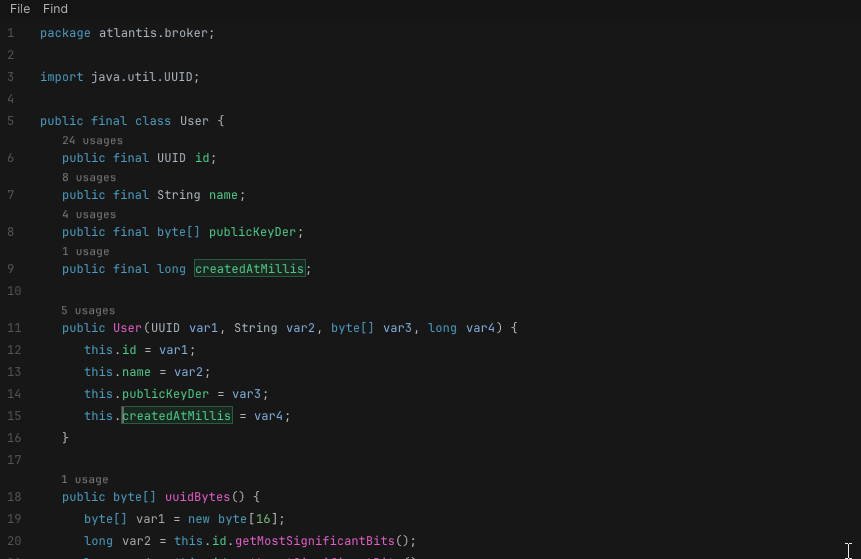
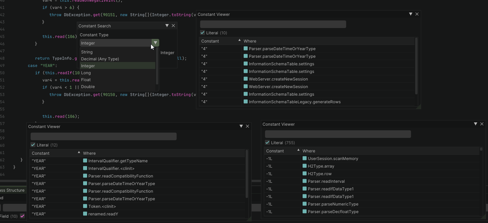

<div align="center">
  <a href="https://github.com/firstfault/trinity">
    
  </a>
  <h1>Trinity</h1>
  <p>A next-generation Java reverse-engineering workspace for exploring, understanding, and rewriting bytecode.</p>

  <p>
    <a href="https://github.com/firstfault/trinity/releases"></a>
    <a href="LICENSE"></a>
    
    
    <a href="https://github.com/firstfault/trinity/stargazers"></a>
  </p>

  <sub>Decompiler &middot; Assembler &middot; Extensive Cross-referencing &middot; Instant Refactoring</sub>
</div>




## What makes Trinity stand out?

### Decompiler

Trinity approaches decompilation differently. Built on the battle-tested [Fernflower](https://www.jetbrains.com/), it integrates directly with the decompiler engine instead of treating the generated Java as plain text. Numerous bugs and anti-decompilation exploits are fixed.

### Renaming

Rename variables, fields, methods, and classes in place. Trinity updates every known usage across the workspace immediately, so you can turn an unreadable codebase into something understandable as you investigate it.



### Cross-referencing

Trinity's cross-reference (Xref) search is instant and exceptionally thorough. It follows references throughout the bytecode, including class literals, annotations, casts, method parameters, return types, field accesses, and invocations.



### Constant search

Search constants across the entire project <b>instantly</b>, not just the strings visible in decompiled source. Strings, numbers, class literals, annotation values, bootstrap arguments, and other class-pool constants are all discoverable.



### Workspaces

Load JVM `.class`/JAR/ZIP inputs and Android `.dex`/APK/APKM inputs into one workspace, then save the complete project as a compressed Trinity database (`.tdb`). DEX files are parsed natively, including multidex APKs and every base/split APK inside APKM bundles, and preserved across workspace save, reopen, editing, and archive export. APKM export reconstructs the original nested bundle layout.

Native DEX classes open as read-only Java-like source reconstructed by JADX, with an editable smali view available alongside it. Trinity parallelizes JADX's app-wide usage indexing, builds one multidex model per workspace, and reuses it across desktop and MCP requests until DEX content changes. Smali remains authoritative: Trinity validates class or method edits, reconstructs the complete containing DEX, reparses it, invalidates the old JADX model, and commits the result atomically. Class, method, field, annotation, register, instruction, reference, and constant metadata is also available through MCP. JVM editing and refactoring tools continue to reject DEX targets; use the native DEX mutation tools instead.

### ...and more!

Built-in refactoring / deobfuscation, custom themes, a built-in theme editor, configurable key mappings, among many others

## Building

Running Trinity requires Java 17 or newer. Gradle 8.4 builds require JDK 17-20; build and run with the checked-in wrapper:

```bash
git clone https://github.com/firstfault/Trinity.git
cd Trinity
./gradlew run
```

The executable fat JAR is produced at `build/libs/Trinity.jar` by `./gradlew build`.
Pre-built versions are available from [GitHub Releases](https://github.com/firstfault/Trinity/releases).


### Built-in MCP server

Trinity starts a Streamable HTTP MCP server with the desktop application:

```text
http://127.0.0.1:7331/mcp
```

The server exposes 45 tools for project lifecycle, JVM and DEX decompilation,
native DEX inspection and mutation, analysis, resource editing, bytecode editing,
naming, and automated refactoring. JVM and DEX tools use exact identities (`owner`, `name`, and
`descriptor`); large results are paginated. Every mutation requires the current
`expectedRevision`, so stale writes fail instead of overwriting concurrent GUI or MCP
changes.

| Area | Tools |
| --- | --- |
| Status and projects | `trinity_status`, `project_create`, `project_open`, `project_save`, `project_close`, `project_export_jar`, `project_get_tree`, `project_search` |
| Classes and members | `class_get`, `class_get_structure`, `class_decompile`, `class_get_hierarchy`, `method_get`, `method_decompile`, `method_get_bytecode`, `field_get` |
| Native DEX | `dex_files`, `dex_classes`, `dex_class_get`, `dex_class_decompile`, `dex_class_disassemble`, `dex_method_get`, `dex_method_decompile`, `dex_method_disassemble`, `dex_find_references`, `dex_constant_search`, `dex_class_validate_smali`, `dex_class_replace_smali`, `dex_method_validate_smali`, `dex_method_replace_smali` |
| Analysis | `xref_find_class`, `xref_find_member`, `constant_search`, `pattern_validate`, `pattern_search`, `invocation_get_details` |
| Mutations | `name_set`, `name_revert`, `resource_create`, `resource_delete`, `resource_read`, `method_validate_bytecode`, `method_replace_bytecode`, `refactor_preview`, `refactor_apply` |

JVM system properties:

| Property | Default | Purpose |
| --- | --- | --- |
| `trinity.mcp.enabled` | `true` | Set to `false` to disable the server. |
| `trinity.mcp.host` | `127.0.0.1` | Loopback address to bind. |
| `trinity.mcp.port` | `7331` | HTTP port; use `0` to select a free port. |

## Authors
- [@final](https://www.github.com/firstfault)
- [@9xz](https://www.github.com/9xz)

### Contributing
Contributions are massively appreciated. Please feel free to open an issue or pull request if anything you need is missing.

### Libraries Used
- [ImGui](https://github.com/ocornut/imgui) with [Bindings](https://github.com/SpaiR/imgui-java)
- [ObjectWeb ASM](https://asm.ow2.io/)
- [smali/dexlib2 and baksmali](https://github.com/google/smali)
- [JADX](https://github.com/skylot/jadx)
- Modified version of [Fernflower Decompiler](https://www.jetbrains.com/)
